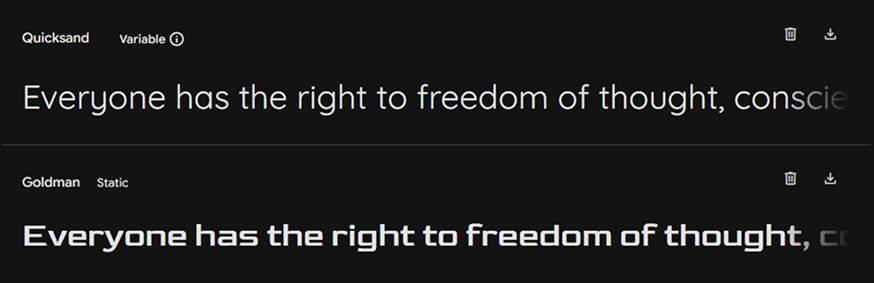
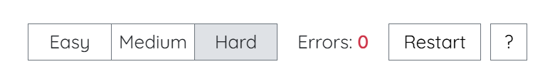

#  Zen Grid - Sudoku Online Website

About
Zen Grid is a modern Sudoku web application designed for focus and relaxation. The website's core philosophy is to provide a clean, minimalist, and distraction-free experience, allowing players to fully immerse themselves in the logic of the puzzle. With its elegant interface and intuitive design, Zen Grid offers a calm aesthetic for those who love a simple yet challenging puzzle game.

This website is **deployed using GitHub Pages** and can be accessed at: **[https://sasha-fedorov.github.io/zen-grid/](https://sasha-fedorov.github.io/zen-grid/)**

## User Experience (UX) & User Stories

The design of Zen Grid is guided by three core UX principles: Clarity, Intuitive Feedback, and a Streamlined Interface. Each ** Feature has been meticulously crafted to provide a user experience that is not only functional but also enjoyable and stress-free.

### User Stories and Features:
- **Feature: Dynamic Puzzle Generation**
  - As a player, I want to get a unique puzzle with a single solution every time so that each game is a fresh challenge.
- **Feature: Difficulty Selection**
  - As a player, I want to be able to choose between easy, medium, and hard difficulties so I can challenge myself and track my progress.
- **Feature: Errors Count**
  - As a player, I want to see a count of my mistakes so I can track my performance and aim for a flawless game.
- **Feature: Restart Button**
  - As a player, I want to have the option to restart a puzzle to try solving it without errors.
- **Feature: Help Button**
  - As a player, I want to have access to the game rules so I can remember them if I'm a new player or need a refresher.
- **Feature: Game State Persistence**
  - As a player, I want my game progress to be saved automatically so I can leave and come back to the puzzle at any time.
- **Feature: Placed Numbers Highlight**
  - As a player, I want immediate visual feedback on my moves, with incorrect numbers colored red and correct ones in a different color, to quickly identify and fix my mistakes.
- **Feature: Context Highlighting (Tile Selection)**
  - As a player, when I select a cell, I want its corresponding row, column, and 3x3 sector to be highlighted to help me focus on the relevant areas of the board.
- **Feature: Context Highlighting (Number Selection)**
  - As a player, when I select a number from the input panel, I want all instances of that number on the board to be highlighted to help me find and place them.
- **Feature: Variative Game Completion Messages**
  - As a player, I want to receive a personalized completion message based on my performance to make the experience more rewarding and motivating.

<!-- add link to design section with screenshots-->

### User goals

#### New User Goals

A new user's primary goal is to quickly understand the game and begin playing. Zen Grid provides a welcoming and straightforward experience, enabling them to:

- **Start a game without friction:** Easily select a difficulty and get a unique puzzle immediately.
- **Learn the rules:** Access a clear and concise "How to play" guide via the help button.
- **Get comfortable with the interface:** Understand how to select tiles and input numbers with clear visual feedback.
- **Experience a distraction-free environment:** Focus on solving the puzzle without unnecessary visual clutter.

#### Returning User Goals
A returning player's goals are focused on challenge, continuity, and mastery. Zen Grid helps them:

- **Resume a previous game:** Continue a puzzle exactly where they left off thanks to game state persistence.
- **Track progress and improve:** Monitor their performance with the errors counter and try to achieve a flawless solve on any difficulty.
- **Challenge themselves:** Easily switch between different difficulty levels to increase the challenge as their skills grow.
- **Feel a sense of accomplishment:** Receive personalized completion messages that acknowledge their performance and motivate them to tackle a new challenge.

## Design

The design of Zen Grid is a key part of the user experience, focusing on a clean and minimalist aesthetic.

### Color Scheme

The website utilizes a "Zen Palette", a color scheme built on shades of Bootstrap's neutral grays. This palette, complemented by accent colors for highlights and errors, is designed to minimize visual load and create a calm, focused environment for solving puzzles.

### Typography

Zen Grid's typography is carefully selected for both readability and style. The body text and numbers use the **Quicksand** font, chosen for its good legibility. This is paired with **Goldman** for the main "Zen Grid" heading, which provides a distinctive, matching aesthetic. The combination of these fonts contributes to the site's modern and clean feel.

#### Font sizes

- Base font size formula: `min(100vw ÷ 29, 100vh ÷ 42)`
  - Scale text relative to the viewport width (100vw / 29).
  - Scale text relative to the viewport height (100vh / 42).
  - Use the smaller of the two values to keep page and font sizes balanced in both portrait and landscape.
- Main heading: `2.5rem`
- Board tiles and number inputs: `1.25rem`
- Default text: `1rem`

#### Weights
- Main heading: `700`
- Bold text: `600`
- Board tiles and number inputs: `500`
- Default text: `400`

### Imagery
The site's only custom image is a favicon, which also serves as a brand logo in the header. The icon is a simplified representation of a 3x3 Sudoku sector, with numbers placed to signify a correct, incorrect, and pre-filled cells. It is designed with bolder font weight and borders to ensure it remains recognizable even at a small size in a browser tab. This imagery connects the user's browser tab to the website and reinforces the brand's identity.

### Wireframe

The Zen Grid interface was designed with a specific visual blueprint in mind, captured in the wireframes below. These diagrams illustrate the site's modular design and mobile-first approach. By overlaying a grid on the main page layout, the wireframes provide a clear understanding of the site's proportions and how each component fits within the overall page ratio of 29x42. This ensures a consistent and balanced user experience that scales seamlessly across different screen sizes.

### Features (Design Aspect)

Zen Grid was designed with a modular, mobile-first approach. The layout uses CSS Flexbox and Grid to ensure the elements are well-proportioned across different screen sizes. The fluid font-size calculation and use of `rem` units ensure that all text scales gracefully, making the game playable on both mobile devices and larger screens.

- **Header**
  - The prominent heading reinforces the "Zen Grid" brand, accompanied by the favicon icon.

    

- **Controls Section**
  - This section houses the core game controls in an organized, responsive layout. It includes the mode selection buttons, the errors counter for tracking mistakes, and buttons for restarting the puzzle or accessing the game rules.

    

- **Board**
  - The central element of the page, the Sudoku board, is a grid designed to be easy to read and interact with on any device.

    

- **Number Inputs**
  - The number input section provides a simple and clear way for users to enter their answers. The numbers are dynamically removed as the player correctly places all instances of that number.

    
    

- **Copyright Footer**
  - A simple and unobtrusive footer provides a link to the developer's GitHub page and copyright information.
    

- **Highlights**
  - **Selected Input Number Highlight:** When a number on the input panel is selected, all instances of that number on the board are highlighted. This feature helps players to quickly locate numbers and plan their next moves.

    

  - **Selected Tile Highlight:** Selecting a tile on the board triggers a visual highlight of its corresponding row, column, and 3x3 sector. This provides clear visual guidance and helps players focus on the related cells.

    

- **Alerts and Confirmation Boxes**
  - **Game Rules:** A clear and concise modal that explains the rules of Sudoku to new players.

    

  - **New Game Confirmation:** A confirmation dialog appears when a player attempts to start a new game, preventing the accidental loss of a current game's progress.

    

  - **Restart Confirmation:** A simple confirmation box gives the player an opportunity to restart the current puzzle and aim for a better score.

    

  - **Puzzle Completion:** A personalized alert message congratulates the player on completing the puzzle, with messages that vary depending on the difficulty and number of errors.

    
    

    - It redized by a siple randomized selection from predifined messages:

      

## Technologies Used

### Languages and Frameworks

- HTML5
- CSS3
- JavaScript ES6
- Bootstrap 5

### Tools & Programs

- **[VS Code](https://code.visualstudio.com/)** – used as the main code editor for development
- **[Google Chrome](https://www.google.com/chrome/)** – utilized for Browse, testing, and verifying website functionality across various user experiences
- **[Chrome DevTools](https://developer.chrome.com/docs/devtools)** – used for debugging, testing website features and responsiveness
- **[Figma](https://www.figma.com/)** – used to create site favicon and documentation images
- **[Fork](https://fork.dev/)** – used as a Git client for version control and managing project commits

### Services

- **[GitHub](https://github.com/)** – hosted the project repository for version control and collaboration
- **[GitHub Pages](https://pages.github.com/)** – deployed the static website for public access
- **[ChatGPT](https://chat.openai.com/)** – helped generate written content (but not code), as a seach engine, and a problem-solve-helper
- **[Gemini](https://gemini.google.com/)** – helped generate content for this README
- **[Am I Responsive](https://ui.dev/amiresponsive)** – used to create website mockup for this documentation
- **[Coolors](https://coolors.co/)** – used to create website color palette for this documentation

## Validation

### HTML Validation

I validated the deployed version of the website using the **official W3C tools**:

- [Main page](https://validator.w3.org/nu/?doc=https%3A%2F%2Fsasha-fedorov.github.io%2Fzen-grid%2F)

    

- [404 page](https://validator.w3.org/nu/?doc=https%3A%2F%2Fsasha-fedorov.github.io%2Fzen-grid%2F404.html)

    

### CSS Validation

- [Website CSS](https://jigsaw.w3.org/css-validator/validator?uri=https://sasha-fedorov.github.io/zen-grid)

    

**Test passed with no errors**, as confirmed by the validation result link above. All warnings came from Bootstrap.

### JavaScript Validation

I validated two project JavaScript files using the **[official JSHint tools](https://jshint.com/)**:

**Test passed with no warnings**.

### Lighthouse

To evaluate and enhance the site’s performance, accessibility, best practices, and SEO, I ran **[Lighthouse](https://developer.chrome.com/docs/lighthouse)** audits using the deployed version on GitHub Pages. The final Lighthouse scores were all **98 or higher**.

## Deployment & Local Development

### Deployment Process

Deploying the static website using GitHub Pages was a straightforward process:

1. **Navigate to Repository Settings:** From your GitHub repository, click on the **Settings** tab.
2. **Access Pages Section:** In the left-hand sidebar, navigate to the **Pages** section.
3. **Configure Deployment Source:**
   - Under "Build and deployment," select "Deploy from a branch" as the source.
   - Choose your primary branch (e.g., **master**) from the "Branch" dropdown.
   - Keep the default root (`/`) for the folder.
4. **Save Changes:** Click the **Save** button.
5. **Access Website:** After a short wait (usually a few minutes for the build process to complete), your website will become accessible via **[the generated GitHub Pages link](https://sasha-fedorov.github.io/zen-grid/)**.

### Local Development

#### Cloning

To clone the **Zen Grid** repository directly to your local machine:

1. Log in (or sign up) to GitHub.
2. Go to the repository for this project: **[sasha-fedorov/zen-grid](https://github.com/sasha-fedorov/zen-grid)**.
3. Click on the **Code** button (usually green), select your preferred cloning method (HTTPS, SSH, or GitHub CLI), and copy the provided link.
4. Open your **terminal** or **Git Bash**.
5. Change the current working directory to the location where you want the cloned directory to be created.
   - As example `cd Documents/GitHub_Projects`
6. Type `git clone` into the **terminal** and then paste the link you copied in step 3. Press Enter.
   - Example using HTTPS: `git clone https://github.com/sasha-fedorov/zen-grid.git`

#### Forking

To fork the **Zen Grid** repository to your own GitHub account:

1. Log in (or sign up) to GitHub.
2. Go to the repository for this project: **[sasha-fedorov/zen-grid](https://github.com/sasha-fedorov/zen-grid)**.
3. Click the **Fork** button in the top right corner of the page. This will create a copy of the repository under your GitHub account.

## Credits

Basic game logic, idea of populating the board and controls from JavaScript, and inspiration: 

[**Kenny Yip Coding** – How to Build Sudoku JavaScript Tutorial](https://www.youtube.com/watch?v=S4uRtTb8U-U)
- The idea was extended with:
  - Dynamic puzzle generation
  - Difficulty selection
  - Ability to restart the current puzzle
  - Game state saving
  - Game rules pop-up
  - Awarding messages on puzzle completion
  - Correctly and incorrectly placed Numbers highlights
  - Context Highlighting for Tile and Number selections